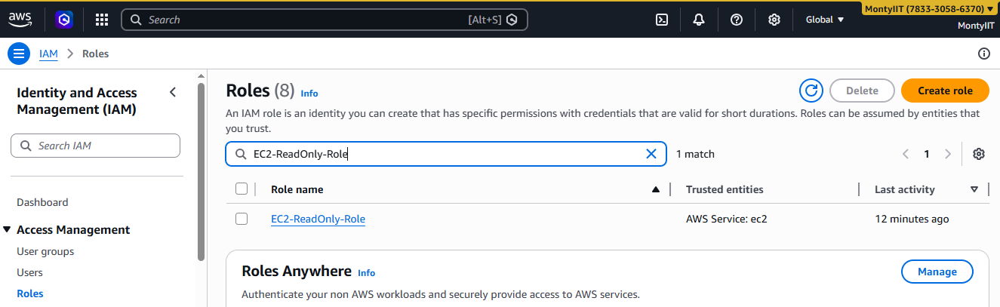
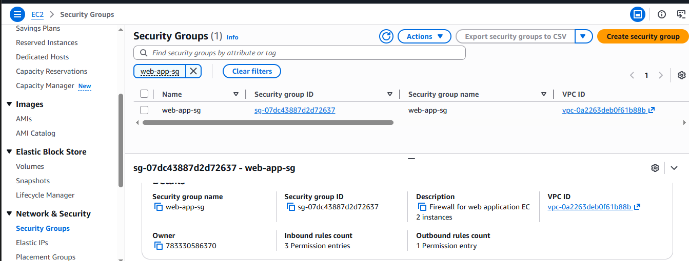
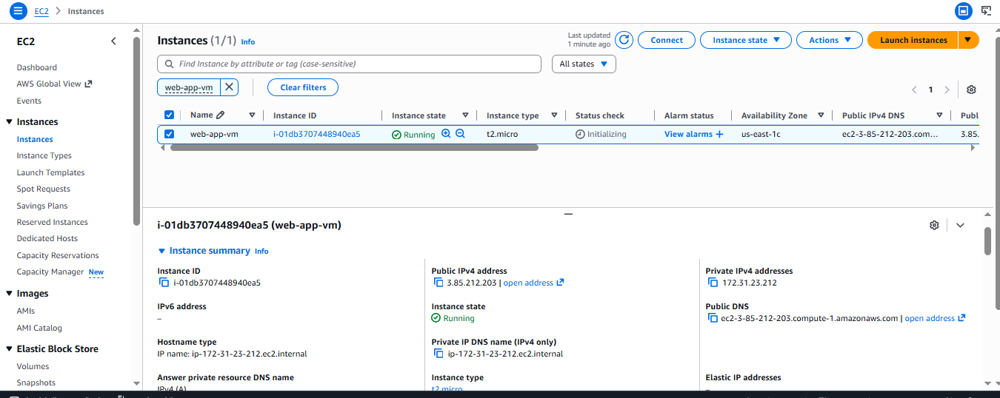
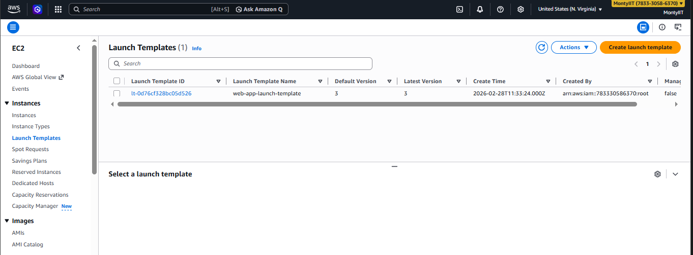
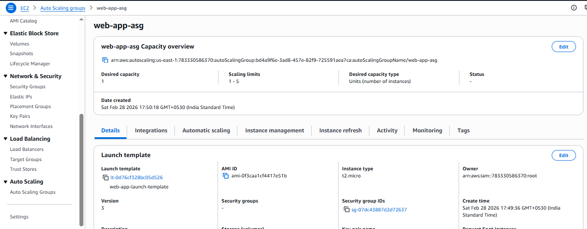
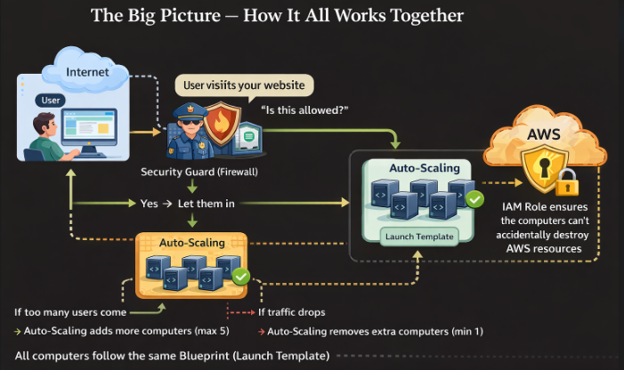
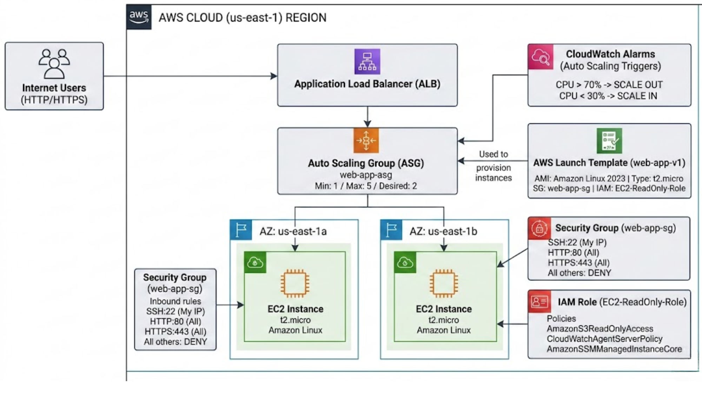

# AWS Infrastructure Setup — Assignment 2

This document walks through everything I set up on AWS for this assignment. All five steps are complete and the resources are live in the **us-east-1 (N. Virginia)** region under the **MontyIIT** account.

---

## Step 1 — Creating an IAM Role

**Role name:** `EC2-ReadOnly-Role`

The first thing I did was head over to **IAM → Roles → Create role** and set up a role that my EC2 instance could use. I chose **AWS Service → EC2** as the trusted entity, which means only EC2 instances can assume this role.

I attached three policies to it:

- **`AmazonS3ReadOnlyAccess`** — lets the EC2 instance read from S3 buckets, but not write anything
- **`CloudWatchAgentServerPolicy`** — allows the instance to push metrics and logs to CloudWatch
- **`AmazonSSMManagedInstanceCore`** — enables Systems Manager access so I don't need to open SSH at all

**Role ARN:** `arn:aws:iam::783330586370:instance-profile/EC2-ReadOnly-Role`



---

## Step 2 — Setting Up a Security Group

**Name:** `web-app-sg` | **ID:** `sg-07dc43887d2d72637`

Next, I created a security group under **EC2 → Security Groups** to control what traffic is allowed in and out of the instance. I kept it pretty minimal — only the ports that are actually needed:

| Type  | Port | Source                  | Why                          |
|-------|------|-------------------------|------------------------------|
| SSH   | 22   | My IP (205.254.163.5/32) | So only I can SSH in         |
| HTTP  | 80   | 0.0.0.0/0               | Anyone can reach the web app |
| HTTPS | 443  | 0.0.0.0/0               | Secure access for everyone   |

Restricting SSH to just my IP is a simple but important security step — no need to leave that open to the world.



---

## Step 3 — Launching the EC2 Instance

**Name:** `web-app-vm` | **Instance ID:** `i-01db3707448940ea5`

With the role and security group ready, I launched an EC2 instance from **EC2 → Launch Instances**. Here's what I went with:

- **AMI:** Amazon Linux 2023 (`ami-0f3caa1cf4417e51b`)
- **Instance type:** `t2.micro` — 1 vCPU, 1 GiB RAM, and it's Free Tier eligible
- **Key pair:** `my-ec2-keypair` (RSA, .pem format)
- **Security group:** `web-app-sg` (the one I just created)
- **Storage:** 20 GiB gp3
- **IAM Role:** `EC2-ReadOnly-Role` attached so it can access S3, CloudWatch, and SSM


---

## Step 4 — Creating a Launch Template

**Name:** `web-app-launch-template` | **ID:** `lt-0d76cf328bc05d526`

A launch template makes it easy to spin up new instances consistently — especially useful for auto scaling. I created the initial template through the Console, then updated it to **Version 3** using [CloudShell](https://us-east-1.console.aws.amazon.com/cloudshell/home?region=us-east-1) so the latest AMI was set as the default.

The template captures all the same settings as the instance above:

- **AMI:** `ami-0f3caa1cf4417e51b` (Amazon Linux 2023)
- **Instance type:** `t2.micro`
- **Key pair:** `my-ec2-keypair`
- **Security group:** `sg-07dc43887d2d72637`
- **IAM profile:** `EC2-ReadOnly-Role`

Here's the CLI command I ran in CloudShell to create the new template version:

```bash
aws ec2 create-launch-template-version \
  --launch-template-id lt-0d76cf328bc05d526 \
  --source-version 1 \
  --launch-template-data '{"ImageId":"ami-0f3caa1cf4417e51b"}' \
  --region us-east-1
```

---

## Step 5 — Auto Scaling Group with CPU-Based Scaling

**Name:** `web-app-asg`

The final step was setting up an [Auto Scaling Group](https://us-east-1.console.aws.amazon.com/ec2/home?region=us-east-1#AutoScalingGroups:) so the infrastructure can handle varying load automatically without manual intervention.

**Group settings:**

| Setting            | Value                              |
|--------------------|------------------------------------|
| Min instances      | 1                                  |
| Desired instances  | 2                                  |
| Max instances      | 5                                  |
| Availability Zones | us-east-1a, us-east-1b, us-east-1c |
| Health check       | EC2 (300s grace period)            |

I also created a **Target Tracking scaling policy** called `scale-out-cpu`. The idea is simple — if average CPU across the group climbs to **70%**, AWS automatically adds more instances. When the load drops back down, it removes them. No manual scaling needed.

A few details on the policy:
- Scale-in is enabled, so instances are cleaned up when they're no longer needed
- New instances get a **300-second warm-up** before they're counted in scaling decisions
- AWS automatically created two CloudWatch alarms: one to trigger scale-out (AlarmHigh) and one for scale-in (AlarmLow)

---

## Architecture





## Web Server Deployment 

### Step 1: Security Group Update

**Command:**

```bash
aws ec2 authorize-security-group-ingress \
  --group-id sg-07dc43887d2d72637 \
  --protocol tcp \
  --port 22 \
  --cidr 18.206.107.24/29 \
  --region us-east-1
```

**Purpose:** Added EC2 Instance Connect IP range to enable browser-based SSH access.

**Result:**  Rule added successfully.

### Step 2: Connect to EC2 Instance

**Method:** EC2 Instance Connect (browser-based SSH)

**Connection details:**
- **Instance:** `i-01db3707448940ea5` (`web-app-vm`)
- **Public IP:** `3.85.212.203`
- **Username:** `ec2-user`
- **Connection Type:** Public IP

**Result:** Successfully connected to instance terminal.

### Step 3: Install Apache Web Server

**Command executed:**

```bash
# Install Apache HTTP Server
sudo yum install httpd -y
```

**Output:**

```text
Package httpd-2.4.66-1.amzn2023.0.1.x86_64 is already installed.
Dependencies resolved.
Nothing to do.
Complete!
```

**Note:** Apache was already installed (from a previous SSM command attempt).

### Step 4: Start and Enable Apache Service

**Commands executed:**

```bash
sudo systemctl start httpd
sudo systemctl enable httpd
sudo systemctl status httpd --no-pager
```

**Service status:**

```text
● httpd.service - The Apache HTTP Server
   Loaded: loaded (/usr/lib/systemd/system/httpd.service; enabled; preset: disabled)
   Active: active (running) since Sun 2026-03-01 11:44:04 UTC; 7min ago
   Main PID: 4454 (httpd)
   Status: "Total requests: 0; Idle/Busy workers 100/0; Requests/sec: 0; Bytes served/sec: 0 B/sec"
```

**Result:**  Apache is running and listening on port 80.

### Step 5: Create Custom HTML Page

**Command:**

```bash
sudo bash -c 'cat > /var/www/html/index.html << EOF
<html>
<head><title>My AWS Web App</title>
<style>
  body {
    font-family: Arial;
    background: #0f1923;
    color: white;
    display: flex;
    justify-content: center;
    align-items: center;
    height: 100vh;
    margin: 0;
    flex-direction: column;
  }
  h1 {
    color: #ff9900;
    font-size: 3em;
    margin: 0;
  }
  p {
    font-size: 1.3em;
    color: #aaa;
  }
  .badge {
    background: #ff9900;
    color: black;
    padding: 10px 25px;
    border-radius: 20px;
    margin: 8px;
    display: inline-block;
    font-weight: bold;
  }
</style>
</head>
<body>
  <h1>🎉 My Web App is LIVE! 🎉</h1>
  <p>Running on AWS EC2 - Auto Scaling Enabled</p>
  <div>
    <span class="badge">VM: web-app-vm</span>
    <span class="badge">Region: us-east-1</span>
    <span class="badge">Auto Scaling: Active</span>
  </div>
</body>
</html>
EOF'
```

 HTML file created at `/var/www/html/index.html`.

## Summary

Here's a quick overview of everything that was created:

| Resource         | Name                      | ID / ARN                                  |
|------------------|---------------------------|-------------------------------------------|
| IAM Role         | `EC2-ReadOnly-Role`        | arn:aws:iam::783330586370:...             |
| Security Group   | `web-app-sg`               | sg-07dc43887d2d72637                      |
| EC2 Instance     | `web-app-vm`               | i-01db3707448940ea5                       |
| Launch Template  | `web-app-launch-template`  | lt-0d76cf328bc05d526 (v3)                 |
| Auto Scaling Group | `web-app-asg`            | Min: 1 / Desired: 2 / Max: 5             |
| Scaling Policy   | `scale-out-cpu`            | Target tracking at 70% average CPU       |

Everything is up and running in **us-east-1 (N. Virginia)** on the **MontyIIT** account.
